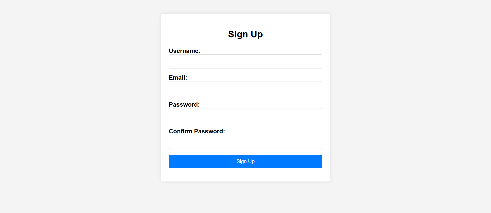
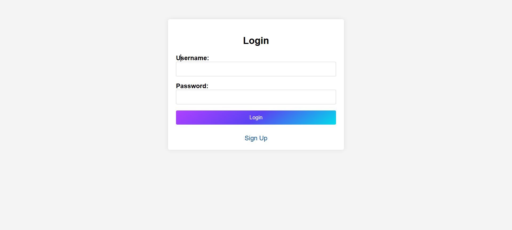
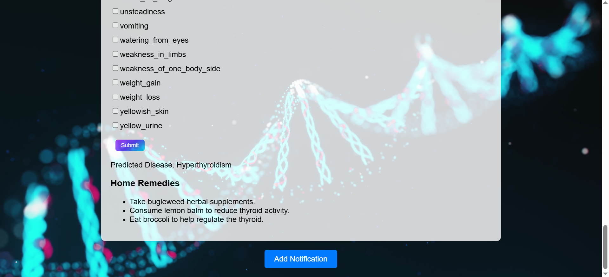

# Health care Monitor

This project is a web-based health care monitor that includes an ML model for disease prediction using symptoms. After predicting the disease, it suggests a home remedy. Additionally, it features a notification system to remind users to take their medication at the correct times.

## Features

- **User Authentication**:  Secure login and registration for users.
- **Search bar**:: Users can search for symptoms in the search bar.
- **Predicting disease**: The model can predict 27 different diseases.
- **Notification system**:  Users can set reminders with custom messages.

## About the model
- Model Accuracy: 80.25%
-Algorithms used in the model:
    KNeighborsClassifier
    RandomForestClassifier
    GaussianNB
    SVC

## Screenshots

### Sign up Page


### Login Page


### Selecting symptoms


### Prediction


### Add notification


### Getting notification


## Installation

### Prerequisites

- Python 3.1.0
- Flask
- SQLite

### Steps

1. **Clone the repository:**
    ```bash
    git clone https://github.com/saliniyan/health-care-monitor
    ```

2. **Navigate to the project directory:**
    ```bash
    cd health-care-monitor
    ```

3. **Create a virtual environment (optional but recommended):**
    ```bash
    python -m venv venv
    source venv/bin/activate  # On Windows, use `venv\Scripts\activate`
    ```

4. **Install the required dependencies:**
    ```bash
    pip install -r requirements.txt
    ```


5. **Run the application:**
    ```bash
    python index.py
    ```

## Usage

1. Open your web browser and go to `http://localhost:5000`.
2. Register for a new account or log in with an existing one.
3. Search and select symptoms to predict diseases and view recommended remedies.
4. Use the notification system to set reminders with custom messages.

## Contact

For any questions or feedback, please open an issue on GitHub or contact saliniyanp02@gmail.com.

