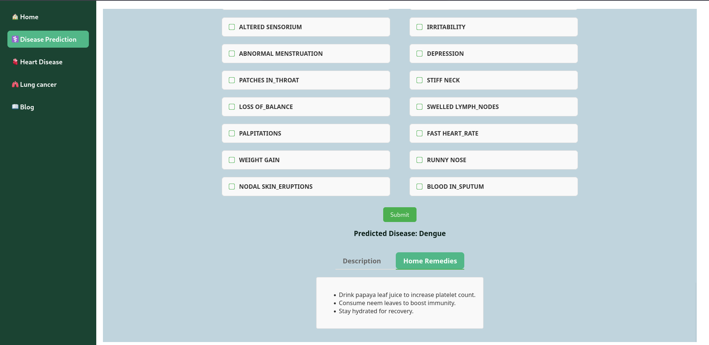

# Disease Insight AI

## Overview
Disease Insight AI is a web-based application that predicts diseases based on user-inputted symptoms and provides descriptions of diseases along with corresponding home remedies. The system leverages machine learning to analyze symptoms and suggest potential diagnoses, assisting users in gaining insights into their health conditions.

## Features
- **Symptom-Based Disease Prediction**: Users can input symptoms to receive predictions of possible diseases.
- **Home Remedies & Health Insights**: Provides remedies and general information about predicted diseases.
- **Interactive & User-Friendly UI**: Built with React for a smooth and intuitive experience.
- **AI-Powered Backend**: Uses a machine learning model to predict diseases.
- **Fast & Secure API**: A Python-based backend efficiently processes requests and delivers predictions.
- **Models Used**: This project utilizes three models:
  1. A model for multiple disease prediction (27 diseases).
  2. A model specifically for heart disease prediction.
  3. A model specifically for lung disease prediction.

## Technology Stack
- **Frontend**: React.js
- **Backend**: Python
- **Machine Learning**: KNeighborsClassifier, RandomForestClassifier, GaussianNB, SVC

### Steps to Run the Application
1. Run the Python backend:
    ```sh
    cd backend
    python app.py
    ```
2. After running the backend, start the frontend:
    ```sh
    cd ..
    npm start
    ```
## Screenshot

### Home Page


### Selection Symptoms


### Disease Prediction and disease descrption


### Home remedies


### Heart Disease


### Lung Cancer


### Blog page

